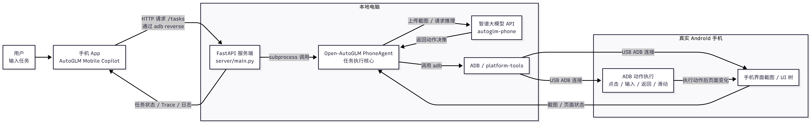

# AutoGLM Mobile Copilot (USB)

基于 [Open-AutoGLM](https://github.com/zai-org/Open-AutoGLM) 的手机 GUI Agent 项目。

在 Windows 电脑上运行 FastAPI 后端，通过 USB ADB 连接并控制 Android 手机。手机端 App 使用 `adb reverse` 访问本地服务 `http://127.0.0.1:8000`，发送自然语言任务并查看 Agent 执行过程。

## 相关仓库

本系列包含三种部署方式，代码结构相同，差异在于后端位置与 ADB 连接方式：

| 版本 | 仓库 | 连接方式 |
| --- | --- | --- |
| **USB（本仓库）** | [USB-Autoglm-Mobile-Copilot](https://github.com/ginny-pjj/USB-Autoglm-Mobile-Copilot) | USB 数据线 + 本地后端 |
| WiFi | [WIFI-Autoglm-Mobile-Copilot](https://github.com/ginny-pjj/WIFI-Autoglm-Mobile-Copilot) | 同 WiFi 无线 ADB + 本地后端 |
| Cloud | [CLOUD-Autoglm-Mobile-Copilot](https://github.com/ginny-pjj/CLOUD-Autoglm-Mobile-Copilot) | 云服务器 + 远程 ADB |

系列说明见 [SERIES.md](SERIES.md)。

> **建议审阅顺序：** 本 README（30 秒）→ [Release 演示视频](#演示视频)（1 分钟）→ 代码目录 `server/`、`mobile-app/`（3 分钟）

---

## 相比官方 Open-AutoGLM，本项目新增

官方 [Open-AutoGLM](https://github.com/zai-org/Open-AutoGLM) 提供命令行 Phone Agent（`python main.py`）。**本项目未重写 Agent 内核**，在 `Open-AutoGLM/phone_agent/` 之上增加：

| 新增模块 | 说明 |
| --- | --- |
| **mobile-app/** | Android 控制端 App（自然语言发任务、看 Trace） |
| **server/** | FastAPI 任务服务（Mock / Real、日志清洗为 Trace） |
| **真机执行** | USB ADB 控制真实 Android 手机 |
| **adb reverse** | App 填 `127.0.0.1:8000` 即可连电脑后端 |
| **多部署方式** | 本仓库为 USB 版；[WiFi](https://github.com/ginny-pjj/WIFI-Autoglm-Mobile-Copilot) / [Cloud](https://github.com/ginny-pjj/CLOUD-Autoglm-Mobile-Copilot) 为扩展 |

---

## 系统架构



**数据流简述：**

1. 用户在 App 输入任务，经 `adb reverse` 以 HTTP 发送到本地 FastAPI（`/tasks`）
2. FastAPI 通过 subprocess 启动 Open-AutoGLM PhoneAgent
3. Agent 截取手机屏幕，调用智谱 `autoglm-phone` 获取动作决策
4. 通过 USB ADB 执行点击 / 输入 / 滑动等操作
5. 截图与页面状态回传 Agent，循环直至任务完成；Trace 与日志回传 App

---

## 功能

| 模块 | 说明 |
| --- | --- |
| Mobile App | 配置服务器地址、提交任务、Mock/Real 模式、结构化 Trace |
| FastAPI | `/health` `/devices` `/tasks` `/tasks/{id}/trace` |
| Open-AutoGLM | 官方 Phone Agent 内核，截图 → 模型决策 → ADB 执行 |
| USB ADB | 通过数据线控制真实 Android 设备 |
| adb reverse | 手机 App 访问 `127.0.0.1:8000` 转发至电脑后端 |

Trace 将 Agent 日志整理为四段：**Observe · Think · Action · Result**。

---

## 环境要求

| 项目 | 要求 |
| --- | --- |
| 系统 | Windows 10/11 |
| Python | 3.10+ |
| 手机 | Android 7.0+，开启 USB 调试 |
| 连接 | USB 数据线（需支持数据传输） |
| ADB | platform-tools |
| 模型 | 智谱 BigModel API Key（`autoglm-phone`） |
| 输入法 | ADB Keyboard（根目录提供 APK，建议安装） |

不需要云服务器、Docker 或 Tailscale。

---

## 快速开始

### 1. 配置环境变量

```text
server/.env.example  →  server/.env
```

```text
BIGMODEL_API_KEY=你的智谱APIKey
AUTOGLM_WORK_ROOT=项目根目录绝对路径
ADB_PATH=adb.exe绝对路径
```

### 2. 启动后端

```cmd
server\start_server.bat
```

### 3. 连接手机

```cmd
server\connect_phone.bat
```

或手动：

```cmd
adb devices
adb reverse tcp:8000 tcp:8000
```

### 4. 安装 App

App 需本地自行打包（需先完成上述后端与 ADB 配置）：

```cmd
mobile-app\build_apk.bat
```

安装生成的 APK 后，服务器地址填 `http://127.0.0.1:8000`，连接测试通过，选择 **Real** 模式执行任务。

---

## 推荐演示任务

```text
打开设置查看WLAN
打开浏览器搜索 Open-AutoGLM
打开美团搜索蜜雪冰城
```

---

## 演示视频

**[观看 USB 版演示视频](https://github.com/ginny-pjj/USB-Autoglm-Mobile-Copilot/releases/download/usb-demo/USB-demo.mp4)**

视频包含：后端启动 → USB 连接与 `adb reverse` → App 提交任务 → 手机自动操作 → Agent Trace 与结果。

> 本项目需配合本地后端与 ADB 环境运行，**无法仅通过单独安装 App 演示**。了解效果请优先观看演示视频；完整复现见上文「快速开始」。

更多版本：[Releases](https://github.com/ginny-pjj/USB-Autoglm-Mobile-Copilot/releases) · [系列说明](SERIES.md)

---

## 项目结构

```text
├── mobile-app/           # React Native / Expo Android App
├── server/               # FastAPI 后端
│   ├── main.py
│   ├── start_server.bat
│   └── connect_phone.bat
├── Open-AutoGLM/         # 官方 Phone Agent（phone_agent/ 内核）
│   └── phone_agent/
│       ├── agent.py
│       ├── adb/
│       ├── actions/
│       ├── config/
│       └── model/
├── docs/                 # 架构说明、FAQ 等
├── assets/               # 架构图、App 截图
│   └── architecture-usb.png
├── ADBKeyboard.apk
└── SERIES.md             # 系列仓库说明
```

`phone_agent/` 目录说明见 [docs/phone_agent-目录对照.md](docs/phone_agent-目录对照.md)。

---

## 文档

- [架构与实现逻辑](docs/architecture.md)
- [phone_agent 目录对照](docs/phone_agent-目录对照.md)
- [常见问题](docs/faq.md)

---

## 致谢

基于 [zai-org/Open-AutoGLM](https://github.com/zai-org/Open-AutoGLM)，遵循上游 License。

请勿在仓库中提交 API Key 或含隐私信息的录屏。
