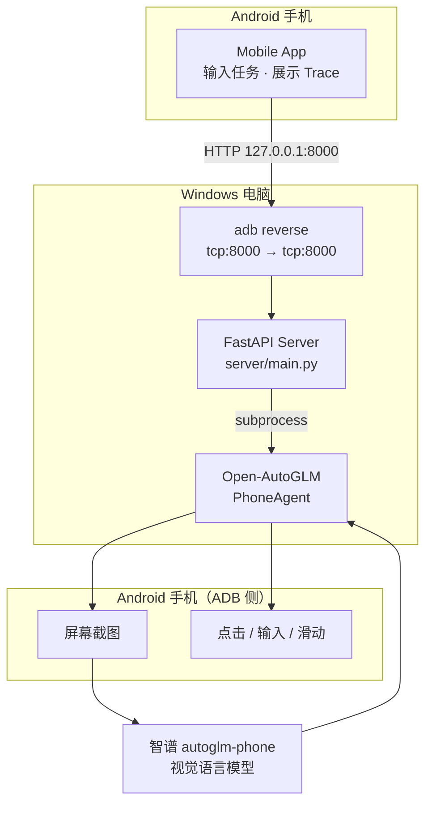
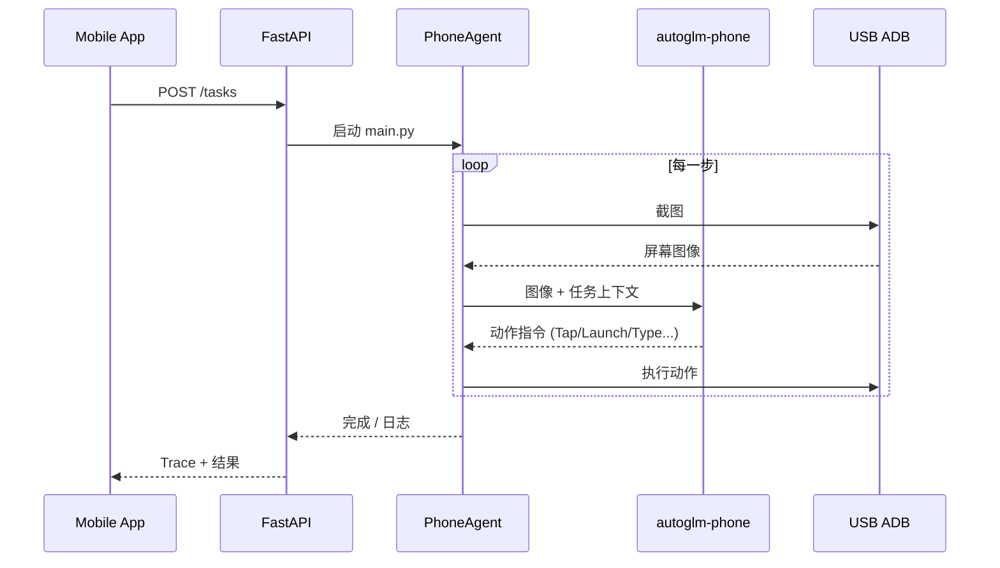

# AutoGLM Mobile Copilot (USB)

基于 [Open-AutoGLM](https://github.com/zai-org/Open-AutoGLM) 的手机 GUI Agent 项目。

在 Windows 电脑上运行 FastAPI 后端，通过 USB ADB 连接并控制 Android 手机。手机端 App 使用 `adb reverse` 访问本地服务 `http://127.0.0.1:8000`，发送自然语言任务并查看 Agent 执行过程。

## 相关仓库

本系列包含三种部署方式，代码结构相同，差异在于后端位置与 ADB 连接方式：

| 版本 | 仓库 | 连接方式 |
| --- | --- | --- |
| **USB（本仓库）** | [USB-Autoglm-Mobile-Copilot](https://github.com/ginny-pjj/USB-Autoglm-Mobile-Copilot) | USB 数据线 + 本地后端 |
| WiFi | [WIFI-Autoglm-Mobile-Copilot](https://github.com/ginny-pjj/WIFI-Autoglm-Mobile-Copilot) | 同 WiFi 无线 ADB + 本地后端 |
| Cloud | [CLOUD-Autoglm-Mobile-Copilot](https://github.com/ginny-pjj/CLOUD-Autoglm-Mobile-Copilot) | 云服务器 + 远程 ADB |

系列说明见 [SERIES.md](SERIES.md)。

---

## 系统架构



### Agent 执行流程



---

## 功能

| 模块 | 说明 |
| --- | --- |
| Mobile App | 配置服务器地址、提交任务、Mock/Real 模式、结构化 Trace |
| FastAPI | `/health` `/devices` `/tasks` `/tasks/{id}/trace` |
| Open-AutoGLM | 官方 Phone Agent 内核，截图 → 模型决策 → ADB 执行 |
| USB ADB | 通过数据线控制真实 Android 设备 |
| adb reverse | 手机 App 访问 `127.0.0.1:8000` 转发至电脑后端 |

Trace 将 Agent 日志整理为四段：**Observe · Think · Action · Result**。

---

## 环境要求

| 项目 | 要求 |
| --- | --- |
| 系统 | Windows 10/11 |
| Python | 3.10+ |
| 手机 | Android 7.0+，开启 USB 调试 |
| 连接 | USB 数据线（需支持数据传输） |
| ADB | platform-tools |
| 模型 | 智谱 BigModel API Key（`autoglm-phone`） |
| 输入法 | ADB Keyboard（根目录提供 APK，建议安装） |

不需要云服务器、Docker 或 Tailscale。

---

## 快速开始

### 1. 配置环境变量

```text
server/.env.example  →  server/.env
```

```text
BIGMODEL_API_KEY=你的智谱APIKey
AUTOGLM_WORK_ROOT=项目根目录绝对路径
ADB_PATH=adb.exe绝对路径
```

### 2. 启动后端

```cmd
server\start_server.bat
```

### 3. 连接手机

```cmd
server\connect_phone.bat
```

或手动：

```cmd
adb devices
adb reverse tcp:8000 tcp:8000
```

### 4. 配置 App

服务器地址：

```text
http://127.0.0.1:8000
```

连接测试通过后，选择 **Real** 模式执行任务。

---

## 推荐演示任务

```text
打开设置查看WLAN
打开浏览器搜索 Open-AutoGLM
打开美团搜索蜜雪冰城
```

---

## 演示视频

录屏演示见 [GitHub Releases](https://github.com/ginny-pjj/USB-Autoglm-Mobile-Copilot/releases)。

上传 Release 后，可将链接改为具体文件地址，例如：

```markdown
[演示视频](https://github.com/ginny-pjj/USB-Autoglm-Mobile-Copilot/releases/download/v1.0-demo/demo_usb.mp4)
```

---

## 项目结构

```text
├── mobile-app/           # React Native / Expo Android App
├── server/               # FastAPI 后端
│   ├── main.py
│   ├── start_server.bat
│   └── connect_phone.bat
├── Open-AutoGLM/         # 官方 Phone Agent（phone_agent/ 内核）
│   └── phone_agent/
│       ├── agent.py
│       ├── adb/
│       ├── actions/
│       ├── config/
│       └── model/
├── docs/                 # 架构说明、FAQ 等
├── ADBKeyboard.apk
└── SERIES.md             # 系列仓库说明
```

`phone_agent/` 目录说明见 [docs/phone_agent-目录对照.md](docs/phone_agent-目录对照.md)。

---

## 基于 Open-AutoGLM 的扩展

官方 [Open-AutoGLM](https://github.com/zai-org/Open-AutoGLM) 提供 CLI 形式的 Phone Agent。本项目在其基础上增加：

- **server/**：HTTP API 封装，支持 Mock/Real 与 Trace 清洗
- **mobile-app/**：Android 控制端
- **adb reverse 本地访问方案**：简化 USB 场景下的 App 联调

Agent 核心逻辑未重写，仍使用 `Open-AutoGLM/phone_agent/`。

---

## 文档

- [架构与实现逻辑](docs/architecture.md)
- [phone_agent 目录对照](docs/phone_agent-目录对照.md)
- [常见问题](docs/faq.md)

---

## 致谢

基于 [zai-org/Open-AutoGLM](https://github.com/zai-org/Open-AutoGLM)，遵循上游 License。

请勿在仓库中提交 API Key 或含隐私信息的录屏。
