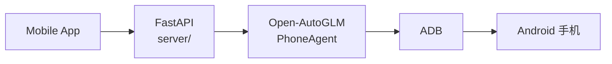

# AutoGLM Mobile Copilot 系列

基于 [Open-AutoGLM](https://github.com/zai-org/Open-AutoGLM) 的手机 GUI Agent，在官方 Phone Agent 之上增加了 FastAPI 后端与 Android 控制端 App。

## 仓库列表

| 版本 | 仓库 | 后端 | 手机连接 | App 服务器地址 |
| --- | --- | --- | --- | --- |
| USB | [USB-Autoglm-Mobile-Copilot](https://github.com/ginny-pjj/USB-Autoglm-Mobile-Copilot) | Windows 本地 | USB 数据线 | `http://127.0.0.1:8000` |
| WiFi | [WIFI-Autoglm-Mobile-Copilot](https://github.com/ginny-pjj/WIFI-Autoglm-Mobile-Copilot) | Windows 本地 | 同 WiFi 无线 ADB | `http://电脑局域网IP:8000` |
| Cloud | [CLOUD-Autoglm-Mobile-Copilot](https://github.com/ginny-pjj/CLOUD-Autoglm-Mobile-Copilot) | 云服务器 Docker | Tailscale + 无线 ADB | `http://云服务器IP:8000` |

## 统一架构

三个仓库共用同一套 `mobile-app/`、`server/`、`Open-AutoGLM/` 代码结构，仅部署与 ADB 连接方式不同。

## 演示视频

| 版本 | Releases |
| --- | --- |
| USB | [releases](https://github.com/ginny-pjj/USB-Autoglm-Mobile-Copilot/releases) |
| WiFi | [releases](https://github.com/ginny-pjj/WIFI-Autoglm-Mobile-Copilot/releases) |
| Cloud | [releases](https://github.com/ginny-pjj/CLOUD-Autoglm-Mobile-Copilot/releases) |

## 文档入口

- USB：[README](https://github.com/ginny-pjj/USB-Autoglm-Mobile-Copilot/blob/main/README.md)
- WiFi：[README](https://github.com/ginny-pjj/WIFI-Autoglm-Mobile-Copilot/blob/main/README.md)
- Cloud：[README](https://github.com/ginny-pjj/CLOUD-Autoglm-Mobile-Copilot/blob/main/README.md) · [云端部署](https://github.com/ginny-pjj/CLOUD-Autoglm-Mobile-Copilot/blob/main/docs/cloud-deploy.md)
